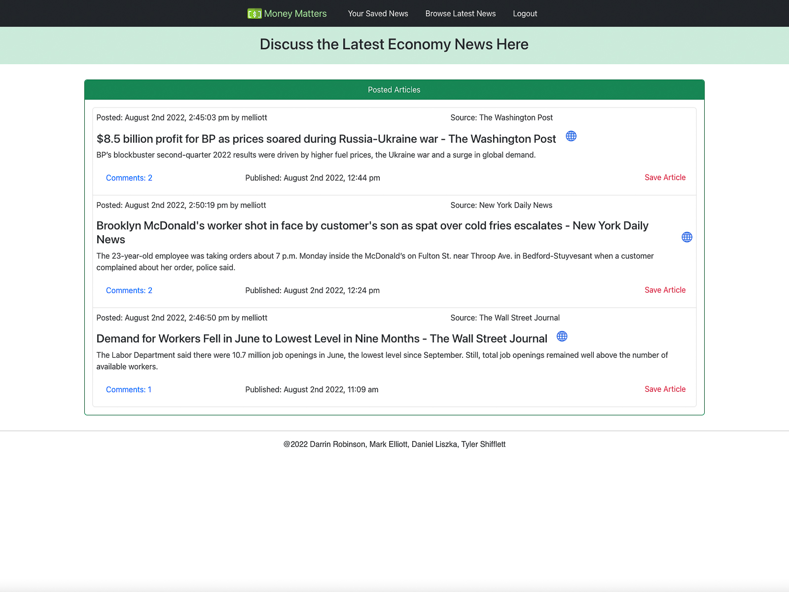

# Money Matters

## Description

This application is an economics focused news sharing website where users can post economic related news provided by newsapi.org. The users can browse available articles for viewing and optionally post them to the main page for public viewing. The user can also save the article to their account. Users can create/delete/edit comments to publicly posted news articles.

## Table of Contents

- [Installation](#installation)
- [Usage](#usage)
- [Credits](#credits)
- [License](#license)

## Installation

This application runs on Heroku.com

## Usage

### Technical Components

- React
- Apollo
- Apollo-server
- Node.js
- axios
- Bcrypt
- express.js
- Graphql
- Jwt-decode
- jsonwebtoken
- dotenv (enviroment variables)
- Mongoose

- CSS: react-bootstrap
- API: newsapi.org

## Credits

Mark Elliott https://github.com/melliott7264

Daniel Liszka https://github.com/DanielLiszka

Tyler Shifflett https://github.com/TylerS175

Darrin Robinson https://github.com/Darobinson20

## License

Copyright (c) 2022 Mark Elliott, Daniel Liszka, Tyler Shifflet, Darrin Robinson

Permission is hereby granted, free of charge, to any person obtaining a copy
of this software and associated documentation files (the "Software"), to deal
in the Software without restriction, including without limitation the rights
to use, copy, modify, merge, publish, distribute, sublicense, and/or sell
copies of the Software, and to permit persons to whom the Software is
furnished to do so, subject to the following conditions:

The above copyright notice and this permission notice shall be included in all
copies or substantial portions of the Software.

THE SOFTWARE IS PROVIDED "AS IS", WITHOUT WARRANTY OF ANY KIND, EXPRESS OR
IMPLIED, INCLUDING BUT NOT LIMITED TO THE WARRANTIES OF MERCHANTABILITY,
FITNESS FOR A PARTICULAR PURPOSE AND NONINFRINGEMENT. IN NO EVENT SHALL THE
AUTHORS OR COPYRIGHT HOLDERS BE LIABLE FOR ANY CLAIM, DAMAGES OR OTHER
LIABILITY, WHETHER IN AN ACTION OF CONTRACT, TORT OR OTHERWISE, ARISING FROM,
OUT OF OR IN CONNECTION WITH THE SOFTWARE OR THE USE OR OTHER DEALINGS IN THE
SOFTWARE.

---

🏆 The previous sections are the bare minimum, and your project will ultimately determine the content of this document. You might also want to consider adding the following sections.

## Badges

Badges aren't necessary, per se, but they demonstrate street cred. Badges let other developers know that you know what you're doing. Check out the badges hosted by [shields.io](https://shields.io/). You may not understand what they all represent now, but you will in time.

## Features

If your project has a lot of features, list them here.

## How to Contribute

If you created an application or package and would like other developers to contribute it, you can include guidelines for how to do so. The [Contributor Covenant](https://www.contributor-covenant.org/) is an industry standard, but you can always write your own if you'd prefer.

## Tests

Go the extra mile and write tests for your application. Then provide examples on how to run them here.
